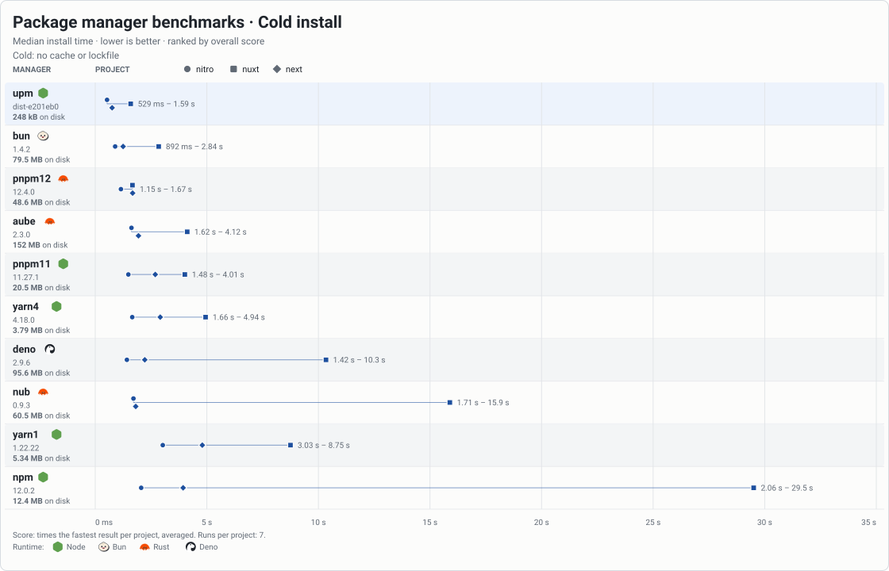
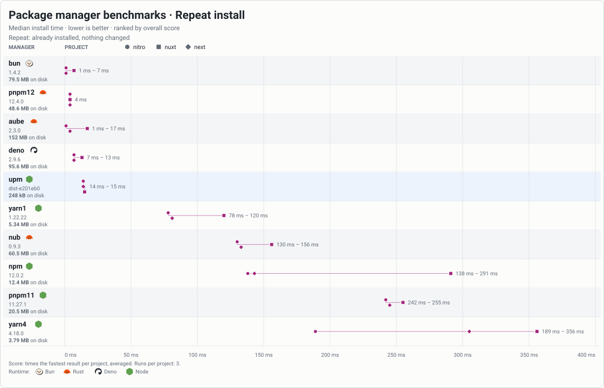
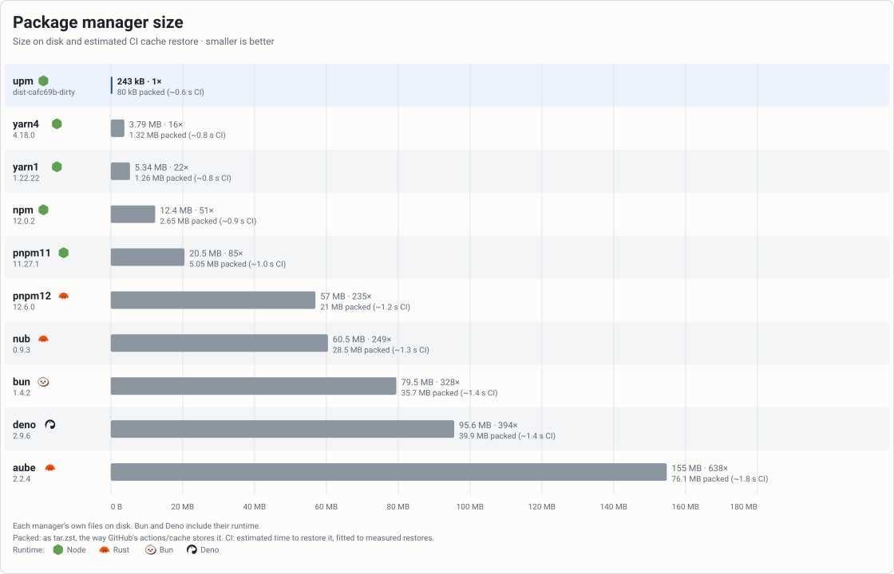

<h1 align="center">
  <picture>
    <source media="(prefers-color-scheme: dark)" srcset="./.github/logo-dark.svg">
    <source media="(prefers-color-scheme: light)" srcset="./.github/logo-light.svg">
    
  </picture>
</h1>

⚡ A fast, tiny package manager for the npm registry, written in TypeScript.

- 🟦 **Pure JS:** built with TypeScript and Node.js builtins.
- 🪶 **Small:** about <!-- size:upm -->320 kB<!-- /size --> on disk (<!-- size:upm:packed -->107 kB<!-- /size --> packed), small enough to bundle into your own tools.
- 🚀 **Fast:** install speed on par with package managers written in Rust.
- 🧩 **Programmable:** every command is also a JavaScript function you can import.
- 🎯 **Simple:** no new config files or conventions. Your existing `.npmrc` just works.
- 🔒 **Secure:** defaults to a 1-day [minimum release age](#release-age) and skips dependency lifecycle scripts.
- 📦 **Lockfile compatibility:** supports existing `package-lock.json`, `pnpm-lock.yaml` and `bun.lock` out of the box.

## 🤔 Why another package manager?

There are already several popular package managers:

- **npm** ships with Node.js, but it is simply slow.
- **pnpm** is fast and well designed, but it keeps growing in size, features and customization settings.
- **Yarn** (berry) has become complex, with its own concepts and unusual requirements.
- **Bun**, **Deno** and **Nub** are fast, but they fit best when you also use them as runtime and not Node.js.

Furthermore:

- 🟢 **Node.js is capable.** It already has worker threads, zlib, fetch and every other needed feature.
- 🦀 Native package managers are much larger to download and store on disk, for every version. In CI, just fetching the binary, even from a cache, can cost more time than it could save! Most of the bytes in these binaries are already native features that Node.js already has. In our benchmarks, pnpm 12 takes <!-- size:pnpm12 -->59.8 MB<!-- /size --> and aube <!-- size:aube -->44.5 MB<!-- /size --> on disk; upm ~<!-- size:upm -->320 kB<!-- /size -->.
- 🔌 **Programmatic API.** The only possible way to install dependencies is spawing command in a separate process. None of the current package managers are small enough to bundle and embed into another library.

💡 upm started as an experiment: how fast and small can an npm client be in pure TypeScript,
making the most of what Node.js already provides? And answer turned out to be possbile!

## Get started

Install upm globally. The scripts check for Node.js 22.3+, then install upm with npm.

```sh
# macOS / Linux
curl -fsSL https://upm.sh/install.sh | sh

# Windows (PowerShell)
irm https://upm.sh/install.ps1 | iex

# npm
npm i -g upm --min-release-age 0
```

Then install your project's dependencies:

```sh
upm i
```

> [!IMPORTANT]
> **Prerelease:** upm is not stable yet see [current limits](#current-limits).

## Quick reference

```sh
upm install                          # install the project's dependencies (also upm alone)
upm add vue@^3 nanoid                 # save to package.json, then install
upm add --dev vitest                  # save as a dev dependency
upm add --optional fsevents           # save as an optional dependency
upm add --exact nanoid                # save the selected version without a caret
upm remove nanoid                     # remove from package.json, then install
upm add shared -w app                 # add a dependency to workspace app
upm run                              # list project scripts
upm run build                        # run the project's build script
upm run --workspaces build           # build workspaces in dependency order
upx cowsay hello                     # run a package's command, installing it if needed
upm dedupe                           # reduce duplicate versions already locked
upm install --production             # skip packages used only by dev dependencies
upm install --frozen-lockfile        # CI: fail if the lockfile is missing or stale
upm install --verify                 # check file hashes and links, repair damage
upm install --offline                # no network: install from upm.lock and the store
upm lock                             # write upm.lock without installing packages
upm resolve vue@^3                   # show which registry version matches
upm fetch nanoid                     # cache this package, without its dependencies
upm fetch --lock                     # cache this platform's locked packages
upm prune                            # clean up old entries and unreferenced files
```

Commit `upm.lock` with your `package.json`. When switching to upm, delete the old
`node_modules` first. Otherwise, your code may still import old packages.

Use `--dir <path>` to choose a project directory. Otherwise, install commands look
for the nearest `package.json` above the current directory, or the workspace root
that lists it. `--dir` uses the directory you give it; for a workspace tree, point
it at the root and use `-w` where supported.

Most commands support `--json` for machine-readable results. Progress and warnings
go to stderr. `upm lock --json` prints the lockfile **without writing it**.
See `upm --help` for all options, including experimental worker settings.

### Add and remove packages

```sh
upm add vue@^3 nanoid
upm add --dev vitest                  # -D also works
upm add --optional fsevents           # -O also works
upm add --exact nanoid                # -E also works
upm add sw@npm:string-width@^4        # install string-width under the name sw
upm remove nanoid
```

`upm` alone and `upm i` are short for `upm install`, and `upm install <spec>...` is another way to write
`upm add <spec>...`.

- By default, `add` saves to `dependencies`. Use `--dev` or `--optional` for the
  other groups. Adding a package already in another group moves it.
- An explicit version or range is saved as written: `vue@^3` saves `^3`.
- A bare name, `*`, or a tag such as `latest` saves a caret range of the selected
  version. `--exact` saves that version without the caret. It does not change an
  explicit range you supplied.
- `remove` takes a name out of all three dependency groups. It fails if the name
  is not a dependency.
- Unrelated dependencies keep their locked versions after an add or remove.

There is no `update` command yet. Use `add` with a new version or range to change a
package. `dedupe` is not an update command: it prefers already-locked versions.
To choose fresh versions for the whole project, remove `upm.lock` and `node_modules`,
then install again. This can change any version allowed by `package.json`.

### Install from a tarball

```sh
upm add ./vendor/lib-1.0.0.tgz        # saves "lib": "file:vendor/lib-1.0.0.tgz"
upm add https://example.com/lib-1.0.0.tgz
upm add other@https://example.com/lib-1.0.0.tgz
```

A dependency can be an `http://` or `https://` URL of a tarball, or a path to a `.tgz`,
`.tar.gz` or `.tar` file, written `file:vendor/lib.tgz`, `./vendor/lib.tgz` or
`../lib.tgz`. Given without a name, `add` uses the name in the tarball's
`package.json`. In `package.json`, a path is relative to that file, so only the root
and workspaces can use one; `add` reads a path from the current directory and saves it
that way. Absolute paths are refused because they would not work on another machine.
To use a directory, make it a workspace, pack it, or link it (below).

A tarball is read when it is first locked. `upm.lock` keys it by its URL or
root-relative path and records the integrity of its bytes. Its own dependencies come
from the registry.

A local tarball is part of the project, like `package.json`: when you replace it (say,
after `npm pack` again), the next install reads it again and locks the new bytes,
leaving the rest of the tree as it was. Each install checks the file's size and times
first and hashes it only when they change. `--frozen-lockfile` fails instead, as the
lockfile is out of date. A URL is not read again: the lockfile pins its bytes, and an
install that has to fetch it fails with `EINTEGRITY` if the server now sends others. To
take a new version, point the dependency at a new URL, or remove it and add it again.
Credentials in `.npmrc` are sent to a URL on the same host, as for a registry.

### Link a directory

```sh
upm add lib@link:../lib               # saves "lib": "link:../lib"
```

`link:<path>` works as it does in pnpm and yarn. It symlinks the directory into
`node_modules` as it is and links its bins. None of its own dependencies are installed.
The path is relative to the `package.json` that declares it, so only the root and
workspaces can use one. It may lead outside the project. `upm.lock` keeps only the link.
Its bins come from the directory's `package.json`, read again whenever that file changes.
A link to a directory that does not exist is made anyway, with a warning. It is never used
as another package's peer dependency. bun's `link:<name>` (a package registered with
`bun link`) is not supported.

### Install from git

```sh
upm add github:unjs/ufo#v1.5.4         # also unjs/ufo#v1.5.4
upm add git+https://github.com/unjs/ufo.git#3f1c0a2
upm add gitlab:group/sub/repo#main
```

upm does not run git. A git dependency on GitHub, GitLab or Bitbucket is installed from
the host's archive of its ref, the way a tarball URL is: `upm.lock` keys it by that
archive URL and pins its bytes. `package.json` keeps the spec as written. These forms
work: `github:`, `gitlab:` and `bitbucket:` shortcuts, `user/repo` for GitHub,
`git://`, `git+https://`, `git+ssh://`, `git@host:user/repo` and `https://` URLs of those
hosts ending in `.git`. The ref after `#` is a commit, branch or tag, and `HEAD` when left
out. A package's own git dependencies install the same way.

Other hosts, `#semver:` ranges and `::path:` subdirectories are refused, as they need a
clone. Credentials in a git URL are dropped, so private repositories do not work.
It holds the whole repository, not what `npm pack` would pick. `prepare` and other scripts
are not run, so a repository that only ships sources (no built files committed) installs
but may not load. A branch or `HEAD` moves:
a fresh machine that fetches it after a push fails with `EINTEGRITY`, so pin a tag or
commit.

### Override dependencies

```json
{
  "overrides": { "minimatch": "^9.0.5", "eslint": { "ajv": "6.12.6" }, "react": "$react" },
  "resolutions": { "**/semver": "7.6.3", "jest/chalk": "4.1.2" },
  "pnpm": { "overrides": { "glob@<9": "9.3.5", "request>form-data": "-" } }
}
```

upm reads npm's `overrides`, yarn's `resolutions` and pnpm's `pnpm.overrides` from the
root `package.json`, and the `overrides` of `pnpm-workspace.yaml`, where pnpm 10 and later
keep them:

```yaml
overrides:
  "semver@>=7.0.0 <7.5.2": 7.5.2
  "request>form-data": "-"
```

It changes dependencies across the whole tree to match: those of the root, of each
workspace and of every installed package.

- `name` replaces every dependency on that package. `name@range` replaces only those
  whose declared range overlaps it, as npm and pnpm match: `semver@<7.5.2` replaces
  `^7.0.0` even where that would install 7.6.
- A rule scoped to a parent (`"eslint": { "ajv": … }`, `jest/chalk`, `request>form-data`)
  changes only that parent's own dependencies. The parent can be a workspace, by its
  name. A version range can follow the parent's name too (`eslint@^8`).
- The value can be a range, a version, a tag, an alias (`npm:other@^1`), a tarball URL,
  a git spec on a supported host or a `file:` path from the root. `$name` means the range the root declares for `name`.
  `-` removes the dependency.
- Peer ranges of installed packages are overridden too. This lets a plugin share the
  version the root chose.
- npm refuses an override that conflicts with one of the root's own dependencies. upm
  applies it, as pnpm, yarn and bun do.

`upm.lock` records the overrides. When they change, the next install resolves the
affected dependencies again and keeps the rest of the tree. `--frozen-lockfile` fails
instead.

A package has one set of dependencies in the tree, so a rule nested deeper than one
parent (`"a": { "b": { "c": … } }`, `a/**/c`, `a>b>c`) is not applied. upm warns about
it; pnpm refuses `a>b>c`. Workspaces' overrides, `catalog:` values and the rest of
`pnpm-workspace.yaml` are not read.

## Performance

upm aims to make cached and repeat installs cheap by reusing files and saved
install state. Actual times depend on the package tree, network, filesystem, and
available CPU.

<p>
  <a href="https://raw.githubusercontent.com/unjs/upm/main/bench/charts/warm.svg"></a>
</p>
<p>
  <a href="https://raw.githubusercontent.com/unjs/upm/main/bench/charts/cold.svg"></a>
</p>
<p>
  <a href="https://raw.githubusercontent.com/unjs/upm/main/bench/charts/repeat.svg"></a>
  <a href="https://raw.githubusercontent.com/unjs/upm/main/bench/charts/size.svg"></a>
</p>

Other charts: Peak memory ([cold](https://raw.githubusercontent.com/unjs/upm/main/bench/charts/cold.memory.svg), [warm](https://raw.githubusercontent.com/unjs/upm/main/bench/charts/warm.memory.svg),
[repeat](https://raw.githubusercontent.com/unjs/upm/main/bench/charts/repeat.memory.svg)). CPU time ([cold](https://raw.githubusercontent.com/unjs/upm/main/bench/charts/cold.cpu.svg),
[warm](https://raw.githubusercontent.com/unjs/upm/main/bench/charts/warm.cpu.svg), [repeat](https://raw.githubusercontent.com/unjs/upm/main/bench/charts/repeat.cpu.svg)).

The [benchmark guide](bench/README.md) explains how to compare cold, warm, and
repeat installs with other package managers. It uses private caches and disables
lifecycle scripts for a fairer comparison.

## JavaScript API

The commands are also available as functions from `upm`:

```js
import { add, importx, install, lock, resolve, resolvex, run } from "upm";

// Install from the lockfile, failing if it is out of date
const result = await install({
  dir: "./my-project",
  frozen: true,
  log: (message, level) => console.error(`[${level}] ${message}`),
}); // { packages: 120, workspaces: 0, upToDate: false, stats, ... }

// Add a dependency to package.json and install it
await add(["vue@^3"], {
  dir: "./my-project",
  group: "dependencies",
}); // { added: [{ name: "vue", range: "^3", group: "dependencies" }], ... }

// Resolve a spec to a version without installing
const [vue] = await resolve(["vue@^3"]); // { name: "vue", version: "3.5.13", dist, ... }

// Build the lockfile in memory without writing it
const lockfile = await lock({ dir: "./my-project", write: false }); // { root, packages, ... }

// Run the build script in every workspace
const { code, results } = await run("build", {
  dir: "./my-project",
  workspaces: "all",
  install: true, // install the tree first, as `upm run` does
}); // { code: 0, results: [{ name: "app", path, file, code: 0 }] }

// Import a package at runtime, installing it if needed
const { parse } = await importx("npm:yaml@2"); // also "pkg", "pkg@rc", "@org/name/sub@1"
const url = await resolvex("yaml/util@2"); // "file:///.../yaml/dist/util.js", not imported

// Other exports
import {
  dedupe, // re-resolve, preferring locked versions, then install
  exec, // run a package's bin, installing it if needed
  fetchLockfile, // fill the store from the lockfile, no linking
  fetchPackages, // resolve specs and fill the store, no linking
  listScripts, // list package.json scripts
  prune, // drop unused store and project entries
  remove, // remove dependencies, then install
} from "upm";

// Experimental resolver API (works in browser too)
import {
  createRegistry, // registry client that fetches packuments
  formatLockfile, // lockfile object to text
  fromLockfile, // lockfile object to resolution
  parseLockfile, // lockfile text to object
  parseSpec, // parse a spec such as "vue@^3"
  resolveTree, // resolve a dependency tree
  toLockfile, // resolution to lockfile object
} from "upm/resolver";
```

Functions return data and do not print their own messages. Use `log` for progress,
warnings, and debug messages, and `onProgress` (install, add, remove, dedupe, lock) for
counts to draw a progress bar from. `run` and `exec` still share the child's
terminal input and output.

`importx` imports a package as `upx` runs one: a name without a version, or a version
or range that fits, comes from the nearest `node_modules` above `dir` (default cwd).
Anything else installs where `upx` installs, once per version; a tag or range asks the
registry each time. A subpath goes after the name or its version (`pkg@1/sub`, `pkg/sub@1`).
It resolves the import as Node.js does from that directory, with its default conditions.
`resolvex` takes the same specifier and options and returns the `file://` url instead,
without running the module. Both need Node.js 22.15+.

Errors have a `code` you can handle. The exported `ErrorCode` type lists common
codes; filesystem and worker errors may have others. Options under `experimental`
and the diagnostic `InstallStats` fields may change in any release. See
[`src/api.ts`](src/api.ts) for options and result types.

The main `upm` entry needs Node.js. Its worker threads start from code inside it, not from
separate files, so it can be bundled into your app; when no thread can start, it works on one
thread and warns through `log`. The experimental `upm/resolver` entry provides
the registry client, dependency resolver, and in-memory lockfile tools without
requiring Node. It does not install files or read `.npmrc` for you. See
[`src/resolver.ts`](src/resolver.ts) for its exports.

### Store backend

`storeBackend` puts shared storage behind the store: a team cache, a key-value database, the
browser's OPFS. upm asks it for a package before downloading one, and hands it each package it
downloads before the command returns. The store is still a real directory that projects link
from.

A backend holds bytes by key; upm decides the keys and what they hold:

```js
import { install } from "upm";

const data = new Map();

await install({
  storeBackend: {
    get: async (key) => data.get(key),
    set: async (key, value) => void data.set(key, value),
  },
});
```

Keys are `/`-separated and safe as file names, and a key's value never changes. An optional
`getMany(keys)` reads several in one call. Without `set`, the backend is only read. Packages
downloaded with credentials are not handed to it unless it says it is `private`.

A backend must be trusted as the store is: it decides what a package holds. Its files are
checked against their hashes unless it says it is `trusted`, and its paths must stay inside the
package. A failure or a call quiet for 30 s counts as a miss, and upm downloads instead. See
`StoreBackend` in [`src/store-backend.ts`](src/store-backend.ts).

## Lockfiles and CI

```sh
upm install --frozen-lockfile
upm install --production --frozen-lockfile
upm ci --omit=dev                    # the same, in npm's words
```

`--frozen-lockfile` fails if `upm.lock` is missing, invalid, or out of date with the
project. It does not select versions or rewrite the lockfile. Missing cached
packages still need to be downloaded, so this is not an offline mode.

An install that links `node_modules` from `upm.lock` leaves a copy of it in
`node_modules/.upm.lock`, as npm and pnpm keep one. When `upm.lock` is missing and that
copy still matches `package.json`, `upm install` (and `dedupe`) writes it back and goes on
from it: a tree that is already installed is then up to date without the store or the
network. If `package.json` has changed, the copy is ignored and the install resolves as if
there were no `node_modules`. `upm lock` and `--frozen-lockfile` never read the copy.

Registry documents that upm reads while resolving are kept in the store's `metadata`
directory, under paths named after the registry and package
(`metadata/registry.npmjs.org/@scope/name/`), so deleting a directory forgets those
documents. A full document is kept cut down to the fields upm reads, and each notes where its
versions are, so a pick parses only the versions it looks at. A kept document is used
without a request within the `max-age` the registry sent (five minutes on npmjs), and, while
`min-release-age` is on, for as long as it was fetched after the cutoff: any version it lacks
is too new to pick. After that, upm asks with its ETag and reuses it on a `304`. A tag
written out, such as `upm exec foo@latest`, is always asked about. When a document used
without asking cannot satisfy a range or pin, upm asks the registry once. A kept document
that is damaged, such as cut short or no longer valid JSON, is treated as missing: upm asks
the registry for it again, or fails with `EOFFLINE` under `--offline`.

`--offline` never uses the network. An install from a current lockfile works when the
store already holds its packages, which a past install on the same machine leaves there.
A new version is picked from kept documents, however old. Anything else that needs the
registry or a download fails at once with `EOFFLINE`, including a missing optional package.

`--prefer-offline` also picks from kept documents however old, and asks the registry only
for a name with no kept document, or one whose kept document cannot satisfy the range.
Tags such as `latest` may then be out of date.

`--production` skips packages used only by `devDependencies`. It uses the same
lockfile as a development install; it does not create a smaller lockfile.

The lockfile keeps optional builds for all platforms. At install time, upm uses
the current OS, CPU, and libc to select the right builds. For example, on Linux it
distinguishes glibc from musl builds of native packages. The lockfile is designed
to be shared across machines, but that does not mean the installer is fully tested
on every platform. Incomplete registry metadata can also hide some libc-only
restrictions.

You can prepare the cache separately:

```sh
upm lock
upm fetch --lock
# Or fetch only production packages:
upm fetch --lock --production
```

`fetch --lock` reads an existing lockfile; it does not refresh it or check it
against `package.json`. It fetches packages for the current platform only.

### Other package managers' lockfiles

If there is no `upm.lock`, upm can install the versions listed in
`package-lock.json`, `pnpm-lock.yaml` or `bun.lock`. It leaves that file unchanged
and does not create an `upm.lock`.

When using another manager's lockfile, upm does not support `add`, `remove` or
`dedupe`. Installation also fails if the lockfile no longer matches `package.json`.
Use the original package manager to update the lockfile, or delete it to let upm
create its own.

upm cannot use these lockfiles if they include workspaces, patches, or git or file
dependencies. `bun.lock` does not say which packages need glibc or musl, so upm
installs both builds on Linux.

## Run scripts

```sh
upm run                   # list scripts
upm run build
upm test --watch           # short for upm run test --watch
upm vitest --run           # no vitest script: runs node_modules/.bin/vitest
upm run test -- --watch    # the first -- is optional
upm run --dir ./app build
upm run --if-present lint  # no lint script is not an error
```

Before a script runs, upm installs the project it belongs to, workspace root and all,
so dependencies are current. When nothing changed this is a quick check, and a tree
installed with `--production` stays that way. A project that declares no dependencies
and was never installed is left alone.

Scripts run in a shell from the selected package directory. Local
`node_modules/.bin` directories are added to `PATH`, so scripts can use installed
command-line tools. Script output goes straight to your terminal.

Put upm's own options **before the script name**. Everything after the name is
passed to the script. `upm <name>` without `run` falls back to an installed bin of
that name when there is no such script; it never installs one. Only the named script runs: upm does not run `prebuild`,
`postbuild`, or other pre/post hooks automatically.

Without workspace options, `run` uses the `package.json` in the current directory,
or in `--dir`. Unlike install, it does not search parent directories.

By design, upm does not run dependency lifecycle scripts during installation.
Packages that rely on install or postinstall scripts to build or download files
may need extra setup.

## Run package commands

```sh
upx vitest --watch                    # the project's vitest when installed
upx cowsay@1.6.0 hello                # an exact version, installed once
upx -p typescript@5 tsc --version     # install packages, then run any command
upx -p eslint -p prettier -c 'eslint . && prettier --check .'
upm exec eslint .                     # upx is short for upm exec
```

`upx` runs a package's command from the current directory, or `--dir`. As with
npm, a command in the nearest `package.json`'s own `bin` comes first. Next, a name
without a version uses a command or package already in a `node_modules` above that
directory, and a version or range uses an installed package that matches it. A tag
such as `@latest` always asks the registry.

Otherwise upm installs the package into its own project, linked from the shared
store: under `node_modules/.upm/.exec` of the project root, so it is removed with that
`node_modules` and can import what the project installed, or under `~/.upm/exec`
when the root has no `node_modules`. It runs the package's only command (or one file
with several names), or the one named after the package. Use `-p` when a package has
several commands or when the command has another name. A tag or range asks the
registry for the newest match each time; each set of versions is installed once.

`-c '<command line>'` runs a whole line in the shell instead, so `&&`, pipes and
variables work. The `-p` packages are installed first and on `PATH`; without `-p`,
only the local `node_modules/.bin` directories are, and nothing is installed.

Put upm's own options before the command; everything after it is passed to the
command. The current project's `.npmrc` chooses the registry and credentials. There
is no prompt before installing (`-y` is accepted and does nothing), and packages run
no install scripts.

### npm commands

```sh
upm login
upm version minor
upm publish --tag next                # upm exec npm publish --tag next
```

npm's commands for the registry, your account and `package.json` run npm itself,
exactly as `upm exec npm <command>`: the project's own npm when installed, otherwise
the latest from the registry. They are `access`, `config`, `create`, `deprecate`,
`dist-tag`, `info`, `init`, `login`, `logout`, `org`, `owner`, `pack`, `ping`, `pkg`,
`profile`, `publish`, `search`, `show`, `stage`, `team`, `token`, `trust`,
`undeprecate`, `unpublish`, `version`, `view` and `whoami`. Only `--dir` goes before
the command; everything after it is npm's. Use `upm run <name>` for a script with one
of these names. They run with npm's `workspaces-update` off, so `version` and `init`
in a workspace never let npm install the tree.

npm reads the same `.npmrc` files, so `upm login` stores a token upm uses too.
Commands that read or change the installed tree, such as `ls`, `outdated`, `audit`
or `update`, are not passed on: npm does not understand upm's `node_modules`
layout or `upm.lock`.

### npm's command lines

Most npm install and run lines work as they are:

- `upm ci` is `upm install --frozen-lockfile`. `uninstall`, `rm`, `r` and `un` are
  `remove`; `run-script` is `run`; `t` and `tst` are `upm run test`.
- `--save-dev`, `--save-optional` and `--save-exact` are `-D`, `-O` and `-E`.
  `--omit=dev` is `--production`, and `--include=dev` undoes either.
  `--prefix <dir>` and `-C <dir>` are `--dir`.
- `-s`, `--silent`, `-q`, `--quiet` and `--loglevel` set to `silent`, `error` or `warn`
  hide progress, the script banner and the install summary. Warnings and errors stay.
- `--no-progress` hides the progress bar. It is drawn on stderr only on a terminal,
  never when `CI` is set. Windows Terminal, ConEmu, Ghostty, WezTerm and VS Code also
  show it on their tab or taskbar.
- These are accepted and do nothing, since upm already works this way: `-S`, `--save`,
  `-P`, `--save-prod`, `--ignore-scripts`, `--no-audit`, `--no-fund`,
  `--legacy-peer-deps` and `--force`.

Flags still go before the script name: `npm run build --if-present` hands
`--if-present` to npm, but `upm run build --if-present` passes it to the script.
Write `upm run --if-present build`.

## Workspaces

A workspace is a local package in a shared project. Declare workspaces in the
root `package.json`:

```json
{
  "private": true,
  "workspaces": ["packages/*", "!packages/legacy"]
}
```

The `{ "workspaces": { "packages": [...] } }` form also works. Each matching
folder with a `package.json` becomes a workspace, except a `node_modules` folder
and anything in one. Names must be unique; if a package has no name, upm uses its
folder name. Patterns must stay inside the project root.

### Link local packages

A workspace can depend on another by name:

```json
{
  "name": "app",
  "dependencies": {
    "shared": "workspace:*"
  }
}
```

`workspace:*`, `workspace:^`, and `workspace:~` always use the local workspace.
`workspace:<range>` also checks that its version matches. A missing or mismatched
workspace is an error, not a reason to download a registry package.

A normal range such as `"shared": "^1.2.0"` uses the workspace when its version
matches. Otherwise, upm uses the registry and reports the mismatch. Only the root
and other workspaces can link to a workspace; dependencies of registry packages
still come from the registry.

### Work with a monorepo

```sh
upm add shared -w app                     # save a caret range of shared's local version
upm add 'shared@workspace:*' -w app       # require the local workspace
upm add --dev vitest -w app
upm remove vitest -w app
upm run -w app build
upm run --workspaces --if-present build
upm run --workspaces --include-workspace-root build
```

- `install`, `lock`, `dedupe`, and `prune` work on the whole tree from its root,
  even when started inside a workspace. There is no filtered `install -w`.
- `add` and `remove` edit one `package.json`: the workspace chosen with `-w`,
  the workspace you are in, or the root otherwise. They then install the whole tree.
- `-w` accepts a workspace name, a path from the root or current directory, or a
  directory containing workspaces. You can repeat it for `run`. For `add` and
  `remove`, the selection must contain exactly one workspace.
- `run --workspaces` runs all workspaces, not the root. Selected workspaces run one
  at a time, after the selected workspaces they depend on. Cycles are reported and
  run in declaration order.
- A failed workspace script does not stop the others. The command exits with the
  first failure's code. `--if-present` skips missing scripts;
  `--include-workspace-root` runs the root's script first. Both options work with
  `run -w` and `run --workspaces`.
- Only the root's `.npmrc` is used for the workspace tree.

The root has one `node_modules/.upm` for registry packages. Each workspace has
its own dependency links and `.bin` directory. The root only gets a link to a
workspace if it declares that dependency. Workspace paths and links are recorded
in `upm.lock`. Workspace or `node_modules` symlinks that lead outside the project
are refused during installation.

`upm publish` and `upm pack` are npm's, which keeps `workspace:` ranges as written. To
publish a package with them, use a tool that rewrites them, such as pnpm, Yarn, or Bun.

## Registries and configuration

upm uses the public npm registry by default. Configure a private registry or scope
in `.npmrc`:

```ini
registry=https://npm.example.com/
@acme:registry=https://npm.example.com/acme/
//npm.example.com/:_authToken=${NPM_TOKEN}
save-exact=true
```

Set `NPM_TOKEN` in your environment rather than committing a token.

Settings are read in this order, with later values taking priority:

1. Global npm config: `<prefix>/etc/npmrc`.
2. User config: `~/.npmrc`.
3. Project config: `.npmrc` at the project root.
4. Environment variables such as `npm_config_registry` and `npm_config_save_exact`.
5. The `--registry <url>` option, for the default registry only, and
   `--min-release-age <days>`, `--before <date>`, `--min-release-age-exclude <glob>`,
   `--offline` and `--prefer-offline`.

A scope's registry still takes priority for packages in that scope, even with
`--registry`.

### Supported settings

An environment variable overrides every `.npmrc` file. An empty cell means the
setting has no form there.

| `.npmrc` key                                          | Environment variable                       | Description                                                                                                        |
| ----------------------------------------------------- | ------------------------------------------ | ------------------------------------------------------------------------------------------------------------------ |
| `registry`                                            | `npm_config_registry`, then `UPM_REGISTRY` | Default registry. Defaults to `https://registry.npmjs.org/`.                                                       |
| `@scope:registry`                                     |                                            | Registry for packages in `@scope`.                                                                                 |
| `//host/path/:_authToken`                             |                                            | Token sent as `Bearer` to URLs under `//host/path/`.                                                               |
| `//host/path/:_auth`                                  |                                            | Base64 `user:password` sent as `Basic` to URLs under `//host/path/`.                                               |
| `//host/path/:username` with `//host/path/:_password` |                                            | `Basic` auth. `_password` is base64-encoded.                                                                       |
| `save-exact`                                          | `npm_config_save_exact`                    | `true` makes `add` save the exact version instead of a `^` range.                                                  |
| `min-release-age`                                     | `npm_config_min_release_age`               | Minimum age in days of newly picked versions. Defaults to `1`; `0` turns it off.                                   |
| `before`                                              | `npm_config_before`                        | Only pick versions published on or before this date.                                                               |
| `min-release-age-exclude`                             | `npm_config_min_release_age_exclude`       | Package names or globs never held back by [release age](#release-age). A `key[]=` list or a comma-separated value. |
| `offline`                                             | `npm_config_offline`                       | `true` never uses the network, as `--offline`.                                                                     |
| `prefer-offline`                                      | `npm_config_prefer_offline`                | `true` picks from kept registry documents without revalidating them, as `--prefer-offline`.                        |
| `hoist`                                               | `npm_config_hoist`                         | `false` leaves out `node_modules/.upm/node_modules`, so packages see only what they declare.                       |
|                                                       | `npm_config_userconfig`                    | Path of the user config file, instead of `~/.npmrc`.                                                               |
| `globalconfig` (user config only)                     | `npm_config_globalconfig`                  | Path of the global config file.                                                                                    |
| `prefix` (user config only)                           | `npm_config_prefix`, `PREFIX`              | The global config file is `<prefix>/etc/npmrc`.                                                                    |
|                                                       | `UPM_STORE`                                | Shared store directory. Defaults to `~/.upm/store`; `--store` takes priority.                                      |
|                                                       | `UPM_LINK_POOL`                            | Same as `--experimental-link-pool`: `off`, `on` or `<size>[,<packages>[,<files>]]`.                                |
|                                                       | `UPM_RESOLVE_POOL`                         | Experimental: threads that read the registry. `off`, `on` or a count up to 16.                                     |
|                                                       | `UPM_DEBUG`                                | `1` or `on` prints debug messages to stderr, as `--verbose`.                                                       |
|                                                       | `UPM_TRACE`                                | Benchmarks: appends one JSON line per event to this file.                                                          |
|                                                       | `UPM_PHASES`                               | Benchmarks: `1` prints phase timings to stderr at exit.                                                            |
|                                                       | `NODE_DISABLE_COMPILE_CACHE`               | `1` turns off the compile cache in `~/.upm/compile-cache`.                                                         |
|                                                       | `NO_COLOR`, `FORCE_COLOR`                  | Turn colored output off or on.                                                                                     |

Values can use `${VAR}` to read an environment variable. `${VAR?}` is empty when
`VAR` is not set; `${VAR}` then stays as written.

Credentials in `.npmrc` must have a `//host/path/` prefix. An unscoped token such
as `_authToken=...` is refused. Credentials apply to both metadata and tarball
requests. They can also be sent to other paths on the same registry host, but not
to another host. If several registries share a host with different credentials,
the first configured registry with a credential covers paths outside their
configured prefixes.

### Release age

By default, upm picks only versions published at least one day ago, so a malicious
release has time to be found and pulled before it reaches your tree. It uses npm's
settings:

```ini
min-release-age=7
min-release-age-exclude[]=@acme/*
min-release-age-exclude[]=my-internal-pkg
```

- `min-release-age=<days>`: the minimum age. `0` turns the check off.
- `before=<date>`: only versions published on or before this date. In the same
  file it takes priority over `min-release-age`; a later config source overrides
  either one.
- `min-release-age-exclude`: package names or globs (`*`, `**`, `?`) that are
  never held back. Their own dependencies still are. A comma-separated value also
  works.

A tag such as `latest` that points to a version that is too new falls back to the
highest version at or below it that is old enough. A range with no version old
enough fails, and the error names the cutoff. The check applies only to new picks:
versions already in `upm.lock` and exact versions such as `1.2.3` are kept as
written. To check a package's age, upm reads the full registry document only when
the package changed after the cutoff. A registry that gives no publish dates cannot be
checked; upm warns once for it and picks as if the check were off.

For standard registry tarball URLs, `upm.lock` leaves out the registry address and
uses the installing machine's config. This lets you change mirrors without
rewriting the lockfile. Nonstandard tarball URLs are kept as written, and an install
warns about any on a host other than the configured registries and npmjs.

Other npm settings, including proxy and certificate options, are not supported.
There is no `upm login` or `upm config set`.

## How it works

upm shares cached files between projects instead of downloading and copying them
again. When nothing has changed, a repeat install does very little work.

Your project sees only the dependencies it declares, so a missing one fails right
away instead of working by accident. Packages get one fallback, as they do with pnpm
and bun: `node_modules/.upm/node_modules` holds one link per package name, so a
package that imports something it forgot to declare still finds it. When a name has
several versions, the one nearest the root wins. Set `hoist=false` in `.npmrc` to
turn this off.

The shared file cache lives at `~/.upm/store`. Change it with `UPM_STORE` or
`--store <path>`; the command-line option takes priority.

Files are stored by content and hardlinked into each project's
`node_modules/.upm`. Hardlinks let projects share the same bytes on disk. upm
falls back to copying when hardlinks are not available, such as across filesystems.

**Do not edit installed package files.** Cached files are read-only because a write
through a shared hardlink can damage the same file in other projects too.

### Storage and repair

To check an installation instead of trusting its saved state:

```sh
upm install --verify
```

This hashes every installed and stored file, checks package links and command-line
tool links, and repairs problems it detects. It also warns about unmet peer dependency
ranges. Peer conflicts are reported, not fixed. Without `--verify`, stored files are
trusted once their tarball passed its integrity check, so a file edited through a
project's hardlink can reach a tree built later from the same store. Downloaded tarballs are
checked against their integrity before being stored; content from a `storeBackend` is
checked against its file hashes only, and not at all when the backend is `trusted`.

To clean up:

```sh
upm prune
```

Prune removes old entries this project no longer needs and cached files that no
valid package index references. It does **not** remove every unused cached
package: a valid index keeps its files even if no project uses that package.
Kept registry documents are not removed either. Files and entries written in the
last hour are left alone. Avoid running prune
during an install; that grace period does not guarantee safe concurrent cleanup.

## Current limits

- **Registry, workspace, tarball, `link:` and hosted git dependencies only.** Git works
  only through a GitHub, GitLab or Bitbucket archive, with no `prepare`. A local
  directory installs only as a `link:`.
- **Workspaces install as one tree.** No filtered installs or catalogs. A
  `workspace:` spec names a workspace by its own name, not by path or alias.
- **Limited peer handling.** Missing required peers are installed, shared by their
  consumers where one version fits all; optional peers are linked only if already
  present. A package gets one copy, not one per set of peers, and an aliased package
  does not count as a peer.

## Credits

Thanks to [npm](https://github.com/npm/cli) for its registry and package behavior,
and [pnpm](https://github.com/pnpm/pnpm) for its shared store and workspace design.
upm is an independent implementation, not a fork.

Thanks to Sondre Bjellås ([@sondreb](https://github.com/sondreb)) for donating the
`upm` package name.

## License

[MIT](LICENSE).
